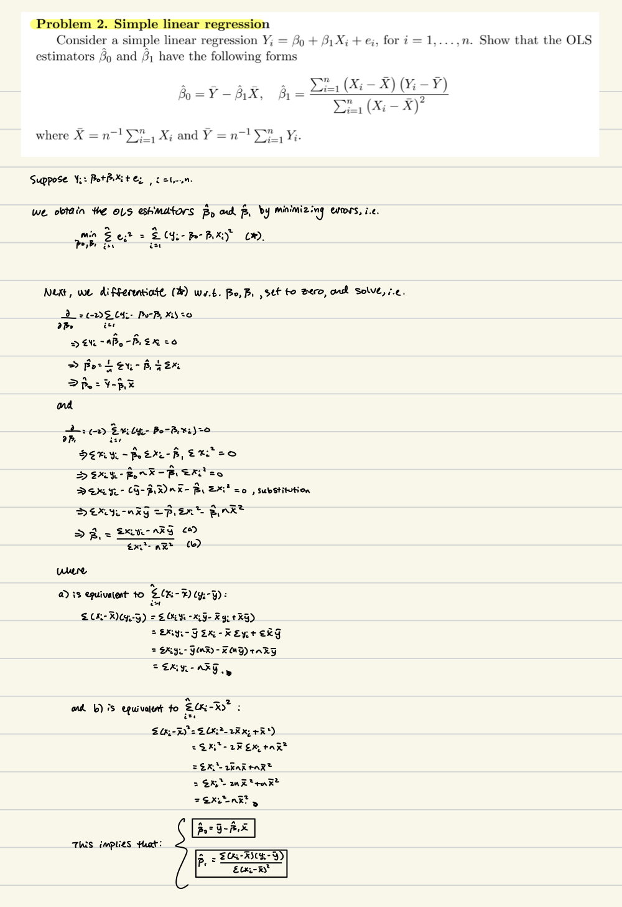
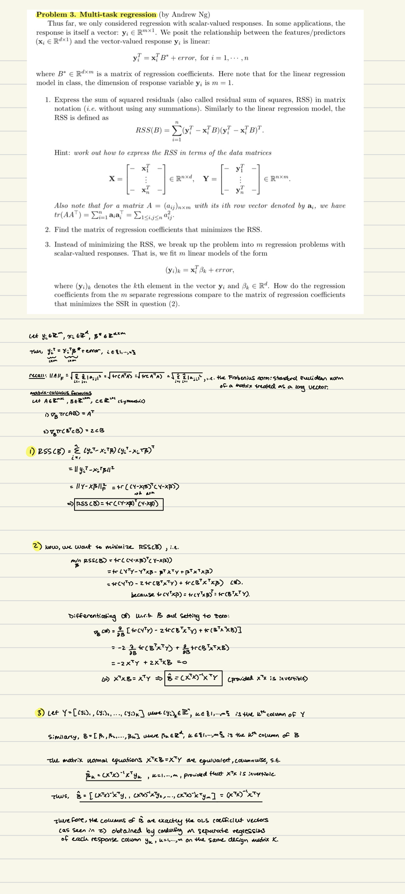

# Problem 1 Instructions

The dataset `teengamb` concerns a study of teenage gambling in Britain. After you install R and the `faraway` package, you can load the faraway package and teengamb data.

1. Make a numerical and graphical summary of the data, commenting on any features that you find interesting. For the variable “sex”, assign the label “male” and “female” and ask R to treat it as a categorical variable before you compute the summary.

Solution to this question should be no longer than 1.5 pages.

2. In your summary, report the means and medians of variables “income” and “gamble”. Please comment on the relative locations of their means and medians, and explain why the means are larger than the medians.

3. How many different values are there for the variable “verbal”? (hint: help(unique))
Based on the boxplot (and any other ways you can define and explain) of the variable “verbal”, what could be the possible values of outlying verbal scores?

4. Suppose you are interested in how variables, such as “verbal”, “income” and “gamble” differ for different ”sex”. Use numerical and/or graphical tool(s) to summarize the data for this purpose, commenting on any features that you find interesting. Limit the output you present to a quantity that a busy reader would find sufficient to get a basic understanding of your answer.

Hints: Some useful R functions for this homework can be found in the course documents that are available on Canvas. You can always type help(subject) to get detailed help on the subject, e.g. help(plot). Or you can type help.start() to get interactive help with a search engine.

```{r setup, include=FALSE}
knitr::opts_chunk$set(echo = TRUE)
```

## Problem 1: Data loading and factor variable

```{r}
# Load faraway package and teengamb data
library(faraway)
data(teengamb)

# Create factor variable for sex with labels
teengamb$sex <- factor(teengamb$sex, levels = c(0, 1), labels = c("male", "female"))
str(teengamb)  # Check structure
```

# (1) Numerical and graphical summary


The summary measures and histograms are provided for the numeric variables. `Status` appears approximately uniform, `verbal` approximately normal, and `income` and `gamble` both right-skewed. There are more male counts (28) versus female counts (19). A pairwise correlation plot among the numeric variables is also provided. `Status` and `verbal` appear most strongly correlated. 
```{r}
# Numerical summary for numeric variables
summary(teengamb[c("status", "income", "verbal", "gamble")])

# Frequency table for sex
table(teengamb$sex)

# Pairs plot for numeric variables
pairs(teengamb[c("status", "income", "verbal", "gamble")])

# Histograms for numeric variables
par(mfrow = c(2, 2))  # Layout for 4 variables
for (v in c("status", "income", "verbal", "gamble")) {
  hist(teengamb[[v]], main = paste("Histogram of", v), xlab = v)
}
par(mfrow = c(1, 1))  # Reset layout
```


# (2) Means and medians of income and gamble

The respective mean and median for `income` and `gamble`variables are provided below. Notice that the mean is pulled towards the right skewness, whereas the median measure is not influenced by this skewness and is therefore smaller in comparison. 
```{r}
# Means and medians of income and gamble with descriptive labels
paste("Mean income:", mean(teengamb$income))
paste("Median income:", median(teengamb$income))
paste("Mean gamble:", mean(teengamb$gamble))
paste("Median gamble:", median(teengamb$gamble))
```

# (3) Unique values and boxplot for verbal

There are nine unique values for the `verbal` variable. The two possible outlying verbal scores are one and two, as illustrated in the below boxplot. 

```{r}
# Number of unique values for verbal
length(unique(teengamb$verbal))

# Boxplot for verbal
boxplot(teengamb$verbal, main = "Boxplot of Verbal Scores", ylab = "verbal")
```

# (4) Compare verbal, income, and gamble by sex

The measures below group the `verbal`, `income` and `gamble` variables according to sex. The distributions appear different across sex for all three variables, with a difference in numeric measures (consult summary statistics). The boxplots provide a visual assessment of this information. 

```{r}
# Numerical summaries of verbal scores by sex
print("Summary of verbal scores by sex:")
tapply(teengamb$verbal, teengamb$sex, summary)

# Numerical summaries of income by sex
print("Summary of income by sex:")
tapply(teengamb$income, teengamb$sex, summary)

# Numerical summaries of gambling expenditure by sex
print("Summary of gambling expenditure by sex:")
tapply(teengamb$gamble, teengamb$sex, summary)

# Boxplots by sex
par(mfrow = c(1, 3))
boxplot(verbal ~ sex, data = teengamb, main = "Verbal by Sex")
boxplot(income ~ sex, data = teengamb, main = "Income by Sex")
boxplot(gamble ~ sex, data = teengamb, main = "Gamble by Sex")
par(mfrow = c(1, 1))
```

# Problem 2



# Problem 3




