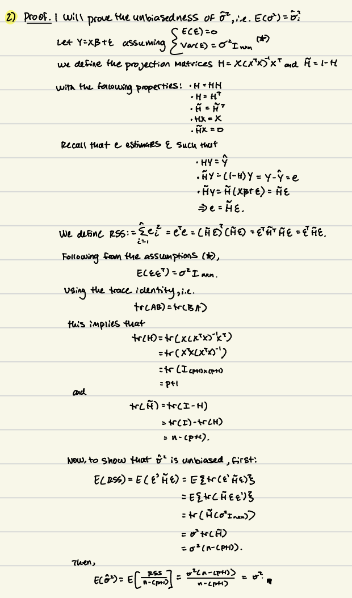

# Problem 1a: Load data and inspect

```{r}
# Load data
library(faraway)
data(uswages)
# Ensure dataset loaded as object
str(uswages)
head(uswages)
```

```{r}
# remove experience var vals less than 0
pos.exper.vals <- uswages$exper >= 0
uswages <- uswages[pos.exper.vals,]

# Numeric summaries
cat("Numeric summary (status, wage, educ, exper):\n")
print(summary(uswages[c("wage", "educ", "exper")]))

```

Notice the relative right skew of `wage`.  
```{r}
par(mfrow = c(1, 3))
hist(uswages$wage, main = "Histogram of wage", xlab = "wage")
hist(uswages$educ, main = "Histogram of educ", xlab = "educ")
hist(uswages$exper, main = "Histogram of exper", xlab = "exper")
par(mfrow = c(1, 1))
```

# Problem 1a: Fit Regression model 

```{r}
model <- lm(wage ~ educ + exper, uswages)
summary(model)
```

# Problem 1b: $(Adj) R^2$
13.39% of the variability in `wage` can be explained by the association with its predictors, `education` and `experience`, under the fitted regression model.  
```{r}
summary(model)$adj.r.squared
```

# Problem 1c: Largest Residual 

```{r}
resid.vals <- residuals(model)
fitted.vals <- fitted(model)

# index via which.max, then report the rowname (label)
max_res_index <- which.max(resid.vals)
obs_label <- rownames(uswages)[max_res_index]

cat("Observation (case number) with largest positive residual:", obs_label, "\n")
print(uswages[obs_label,])
cat("Largest positive residual value:", resid.vals[max_res_index], "\n")
```

# Problem 1d: Means and medians with labels

The mean of the residuals, as expected, is essentially zero. Ordinary least squares (OLS) with an intercept assumes this property. However, the median residual value is approximately -52. That is, the model tends to overpredict for most cases. This suggests a few large positive residuals are balancing many negative residuals. 
```{r}
cat(paste("Mean residual:", mean(resid.vals), "\n"))
cat(paste("Median residual:", median(resid.vals), "\n"))
```

# Problem 1e: Coefficient Interpretation 

Holding education constant, an additional year of experience predicts a 9.77 unit increase in wage. 
```{r}
summary(model)$coefficients
```
# problem 1f: Residual Analysis 

The correlation ~9.87e-17 is effectively zero, indicating no linear association between residuals and fitted values. Geometrically, this reflects that the OLS projects y onto the column space of X, so the residual vector is orthogonal to the fitted vector ($X\hat{\beta}$) and hence has a zero inner product. 
```{r}
cat(paste("Correlation of residuals with fitted values:", cor(resid.vals, fitted.vals), "\n"))

# plot with large y padding and highlight the observation
plot(fitted.vals, resid.vals,
     main = "Residuals vs Fitted (highlight)",
     xlab = "Fitted values", ylab = "Residuals",
     ylim = c(min(resid.vals) - 100, max(resid.vals) + 100))
text(fitted.vals, resid.vals, labels = rownames(uswages), pos = 4, cex = 0.6)
abline(h = 0, col = "grey")
```


# Problem 2 (Unbiasedness of \hat{\sigma^2})




# Problem 3: Polynomial regression — compare lm() vs direct OLS

```{r}
set.seed(123) #for reproducibility
x <- 1:20
y <- x + rnorm(20)
plot(x, y, main = "Artificial data: y = x + noise", xlab = "x", ylab = "y")
```

```{r}
## helper functions 

poly_design <- function(x, degree) {
  # Create Vandermonde design matrix: columns 1, x, x^2, ..., x^degree
  X <- sapply(0:degree, function(d) x^d)
  X <- as.matrix(X)
  colnames(X) <- paste0("x^", 0:degree)
  return(X)
}

ols_coef <- function(X, y) {
  # Compute OLS coefficients via normal equations: (X'X)^{-1} X' y
  X <- as.matrix(X)
  y <- as.numeric(y)
  coef <- solve(t(X) %*% X, t(X) %*% y)
  return(as.numeric(coef))
}
```

```{r}
# initialize results df 
results <- data.frame(degree = integer(), method = character(), status = character(), stringsAsFactors = F)

for (deg in 1:10){
  # Iterate polynomial degrees to compare two estimation methods: 
  # (1) lm() uses raw polynomial terms (I(x^k))
  # (2) Direect OLS via normal equation 
  # For each degree: 
  ## - fit model with lm() and prints coefficients
  ## - constructs the Vandermonde design matrix X; attempt to compute OLS coefs using solve() 
  ## - records success or failure (due to singular/ill-conditioned X'X)
  ## - stops if/when OLS fails
  
  # fit with lm() using raw polynomial terms 
  cat("\n--- Degree", deg, "---\n")
  formula_terms <- if (deg >= 1) paste0("I(x^", 1:deg, ")", collapse = " + ") else ""
  lm_formula <- as.formula(paste("y ~", formula_terms))
  fit_lm <- lm(lm_formula)
  cat("lm() coefficients:\n")
  print(coef(fit_lm))
  
  # build design matrix and try direct OLS
  X <- poly_design(x, deg)
  cat("Trying direct OLS..\n")
  res_ols <- tryCatch({
    coefs <- ols_coef(X, y)
    list(ok = TRUE, coefs = coefs)
  }, error = function(e) {
    cat("Direct OLS failed at degree", deg, "with error:\n")
    cat(e$message, "\n")
    list(ok = FALSE, coefs = NULL)
  })

  if (res_ols$ok) {
    cat("Direct OLS coefficients:\n")
    print(res_ols$coefs)
  }

  results <- rbind(results, data.frame(degree = deg, method = "lm", status = "ok", stringsAsFactors = FALSE))
  results <- rbind(results, data.frame(degree = deg, method = "ols", status = ifelse(res_ols$ok, "ok", "failed"), stringsAsFactors = FALSE))

  if (!res_ols$ok) break
}

cat("\nSummary of where direct OLS failed (if any):\n")
print(results)

cat('\nExplanation: Direct OLS can fail because the matrix t(X)%*%X becomes singular or numerically unstable as polynomial degree increases (multicollinearity). lm() uses more stable algorithms and/or (e.g. QR) to avoid this.\n')    
```


