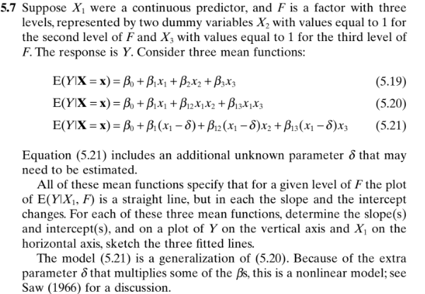
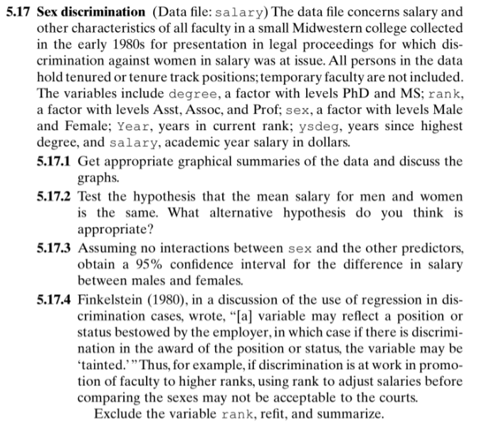

```{r setup, include=FALSE}
knitr::opts_chunk$set(echo = TRUE)
library(faraway)
```

# Problem 1


Data (Description): This data set provides measurements of the diameter, height, and volume of timber in 31 felled black cherry trees. Note that the diameter (inches) is erroneously labelled `Girth` in the data. It is measured at 4 ft 6 in above the ground.  

```{r}
# help(trees)
data(trees)
attach(trees)
head(trees)
```

After fitting the full second-order model, only the linear term for `Girth` was significant, so the model was simplified by removing the non-significant quadratic terms. The resulting model, containing the first-order terms and their interaction, is more parsimonious. In this model, both `Girth` and `Height` are significant. The significant interaction term suggests that the effect of `Girth` on `log(Volume)` depends on the level of `Height`, and vice versa.

```{r}
# second-order polynomial with interaction terms
model <- lm(log(Volume) ~ (Girth + Height)^2 + I(Girth^2) + I(Height^2),
                  data = trees)
# model <- lm(log(Volume) ~ poly(Girth, Height, degree = 2, raw = TRUE),
#                   data = trees)
summary(model)

```

```{r}
model2 <- lm(log(Volume) ~ Girth * Height, data = trees)
summary(model2)
```

# Problem 2



## Question 2 — Comparing Mean Functions

Suppose $X_1$ is continuous and $F$ is a factor with three levels represented by dummy variables $X_2$ and $X_3$.The response is $Y$. The following three mean functions are given:

$$
\begin{aligned}
E(Y|X) &= \beta_0 + \beta_1 X_1 + \beta_2 X_2 + \beta_3 X_3 \quad (5.19) \\
E(Y|X) &= \beta_0 + \beta_1 X_1 + \beta_{12} X_1 X_2 + \beta_{13} X_1 X_3 \quad (5.20) \\
E(Y|X) &= \beta_0 + \beta_1 (X_1 - \delta) + \beta_{12}(X_1 - \delta)X_2 + \beta_{13}(X_1 - \delta)X_3 \quad (5.21)
\end{aligned}
$$

Each model specifies a straight-line relationship between $E(Y|X_1, F)$ and $X_1$ for each level of $F$, but with different assumptions about how the slopes and intercepts vary across levels of $F$.

For each level of $F$:

**Model (5.19):**

$$
E(Y|X_1, F) =
\begin{cases}
\beta_0 + \beta_1 X_1, & F = 1 \\
(\beta_0 + \beta_2) + \beta_1 X_1, & F = 2 \\
(\beta_0 + \beta_3) + \beta_1 X_1, & F = 3
\end{cases}
$$
Intercepts differ; slopes are equal.

**Model (5.20):**

$$
E(Y|X_1, F) =
\begin{cases}
\beta_0 + \beta_1 X_1, & F = 1 \\
\beta_0 + (\beta_1 + \beta_{12})X_1, & F = 2 \\
\beta_0 + (\beta_1 + \beta_{13})X_1, & F = 3
\end{cases}
$$
Intercepts are equal; slopes differ.

**Model (5.21):**

$$
E(Y|X_1, F) =
\begin{cases}
\beta_0 + \beta_1(X_1 - \delta), & F = 1 \\
\beta_0 + \beta_{12}(X_1 - \delta), & F = 2 \\
\beta_0 + \beta_{13}(X_1 - \delta), & F = 3
\end{cases}
$$
Both slope and intercept depend on $\delta$; this is nonlinear in the parameters.

The parameter $\delta$ in Model (5.21) shifts each fitted line horizontally, so all levels of $F$ tend to intersect near $X_1 = \delta$. This shift allows the model to represent different slope and intercept combinations using a single common pivot point. Because $\delta$ multiplies several $\beta$ terms, the model becomes nonlinear in its parameters and more flexible than Models (5.19) and (5.20).


In summary, 

- Model (5.19): Parallel lines — equal slopes, different intercepts by level of $F$.  
- Model (5.20): Common intercept, differing slopes by level of $F$.  
- Model (5.21): Both slope and intercept change as a function of the nonlinear shift parameter $\delta$, generalizing the first two models.

```{r}
# Example coefficient values for illustration

b0 <- 5; b1 <- 2; b2 <- 3; b3 <- 6
b12 <- 1.5; b13 <- 3; delta <- 2

x1 <- seq(0, 10, length.out = 100)

# Model 5.19: same slope, different intercepts

y_519 <- data.frame(
F1 = b0 + b1 * x1,
F2 = (b0 + b2) + b1 * x1,
F3 = (b0 + b3) + b1 * x1
)

# Model 5.20: same intercept, different slopes

y_520 <- data.frame(
F1 = b0 + b1 * x1,
F2 = b0 + (b1 + b12) * x1,
F3 = b0 + (b1 + b13) * x1
)

# Model 5.21: nonlinear parameter \delta; ffects both intercepts/slopes

y_521 <- data.frame(
F1 = b0 + b1 * (x1 - delta),
F2 = b0 + b12 * (x1 - delta),
F3 = b0 + b13 * (x1 - delta)
)

```


```{r}
# Plot each model
par(mfrow = c(1,3))
matplot(x1, y_519, type = "l", lty = 1, lwd = 2,
col = c("black","blue","red"), main = "Model (5.19)",
xlab = "X1", ylab = "E(Y|X1,F)")
legend("topleft", legend = c("F1","F2","F3"),
col = c("black","blue","red"), lty = 1, bty = "n")

matplot(x1, y_520, type = "l", lty = 1, lwd = 2,
col = c("black","blue","red"), main = "Model (5.20)",
xlab = "X1", ylab = "E(Y|X1,F)")
legend("topleft", legend = c("F1","F2","F3"),
col = c("black","blue","red"), lty = 1, bty = "n")

matplot(x1, y_521, type = "l", lty = 1, lwd = 2,
col = c("black","blue","red"), main = "Model (5.21)",
xlab = "X1", ylab = "E(Y|X1,F)")
legend("topleft", legend = c("F1","F2","F3"),
col = c("black","blue","red"), lty = 1, bty = "n")

par(mfrow = c(1,1))
```

# Problem 3



Data Link: http://users.stat.umn.edu/~sandy/alr4ed/data/ 

Data (Description): The data file concerns salary and other characteristics of all faculty in a small Midwestern college collected in the early 1980s for presentation in legal proceedings for which discrimination against women in salary was at issue. The variables include `degree`, a factor level with PhD and MS; `rank`, a factor with levels Asst, Assoc, and Prof; `sex`, a factor with levels Male and Female; `Year`, years in current rank; `ysdeg`, years since highest degree, and `salary`, academic year salary in dollars. 

```{r}
data <- read.csv("salary.csv")
head(data)
# str(data)
```

```{r}
# Convert to factors

# unique(data$degree)
# unique(data$rank)
# unique(data$sex)

data$degree <- factor(data$degree, levels = c("Masters", "PhD"))
data$rank   <- factor(data$rank, levels = c("Asst", "Assoc", "Prof"))
data$sex    <- factor(data$sex, levels = c("Male", "Female"))
```


```{r}
data <- data[, -1] #remove (row) index var 
str(data)
```

- Get appropriate graphical summaries of the data and discuss the graphs 

While there is a discrepancy in the salary distribution according to sex, there is significant overlap in their IQR's. Thus, there is not sufficient (visual) evidence to suggest a significant difference in salary by sex. 

However, rank appears to be (visually) associated with salary, with distinct distributions for each of its three levels (Asst, Assoc, and Prof). 

While the variability in salary for those with Master's degrees is much higher than those with a PhD, there is not enough visual information to make a conclusion about association between degree and salary. 

```{r}
# Boxplots by key factors
par(mfrow = c(1,3))
boxplot(salary ~ sex,   data = data, main = "Salary by Sex",    ylab = "Salary")
boxplot(salary ~ rank,  data = data, main = "Salary by Rank",   ylab = "Salary")
boxplot(salary ~ degree,data = data, main = "Salary by Degree", ylab = "Salary")
par(mfrow = c(1,1))
```

There are 38 males and 14 females in this study. Given the small overall and relative sample sizes, it is hard to discern any notable visual evidence of blatant sex discrimination according to years in the current rank and years since degree variable. Notice, however, that there are more males with higher years in current rank compared to females. We cannot extrapolate this pattern to suggest any discrimination, but it is worth exploring further. Additional formal testing and consideration is required. 

```{r}
table(data$sex)

# Scatterplots vs experience variables, colored by sex
cols <- c("Male" = "steelblue", "Female" = "tomato")
plot(salary ~ year, data = data, col = cols[data$sex], pch = 16,
     main = "Salary vs Years in Current Rank", xlab = "Years in Rank", ylab = "Salary")
legend("topleft", legend = names(cols), col = cols, pch = 16, bty = "n")

plot(salary ~ ysdeg, data = data, col = cols[data$sex], pch = 16,
     main = "Salary vs Years Since Degree", xlab = "Years Since Degree", ylab = "Salary")
legend("topleft", legend = names(cols), col = cols, pch = 16, bty = "n")

```

- Test the hypothesis that the mean salary for men and women is the same. What alternative hypothesis do you think is appropriate 

We test  
$H_0: \mu_{\text{Male}} = \mu_{\text{Female}}$ versus $H_a: \mu_{\text{Male}} \neq \mu_{\text{Female}}$ to assess possible discrimination in salary according to sex. 

Since `sex` is a factor variable, the coefficient `sexFemale` in the fitted linear model represents the estimated difference in mean salary between females and males (after accounting for other predictors in fitted model).  

The regression output shows that `sexFemale` is not statistically significant ($p = 0.214$), suggesting insufficient evidence to conclude a salary difference between men and women once all other predictors are considered. 

```{r}
# full model controlling for other variables 
model = lm(salary ~ ., data)
summary(model)
```
- Assuming no interaction between `sex` and the other predictors, obtain a 95% confidence interval for the difference in salary between males and females

Assuming no interaction between `sex` and other predictors, we can use the additive model fitted (from above) to estimate the adjusted mean difference in salary between males and females.  
The `confint()` function provides a confidence interval for the `sexFemale` coefficient, which represents the difference (Female − Male) in mean salary after adjusting for the other predictors.

The resulting 95% confidence interval corresponds to the adjusted difference in mean salary between females and males. Since this interval contains zero, there is not statistically significant evidence to suggest a salary difference between males and females (after adjusting for other predictors). 

```{r}
confint(model, "sexFemale")
```

- Finkelstein (1980), in a discussion of the use of regression in discrimination cases wrote, "(a) variable may reflect a position or status bestowed by the employer, in which case if there is discrimination in the award of the position or status, the variable may be 'tainted.'" Thus, for example, if discrimination is at work in promotion of faculty to higher ranks, using rank to adjust salaries before comparing the sexes may not be acceptable to the courts. Exclude the variable `rank`, refit and summarize. 

To explore the above assertion, we refit the model excluding `rank` and compare the results.

After removing `rank`, the explanatory power of the model decreases (Adjusted $R^2 = 0.60$ vs. 0.84 previously), and the variability in salary explained by other factors increases.  
All remaining predictors become significant except `sexFemale`, which remains nonsignificant ($p = 0.33$). This suggests that even without controlling for rank, there is still no statistically significant evidence of a sex-based salary difference. However, the decrease in overall fit indicates that rank explains a large portion of salary variation—consistent with its role as a position-level variable that strongly influences pay.


```{r}
# Exclude 'rank' and refit
data.subset <- data[, c("degree", "sex", "year", "ysdeg", "salary")]
model2 <- lm(salary ~ ., data = data.subset)
summary(model2)
```


